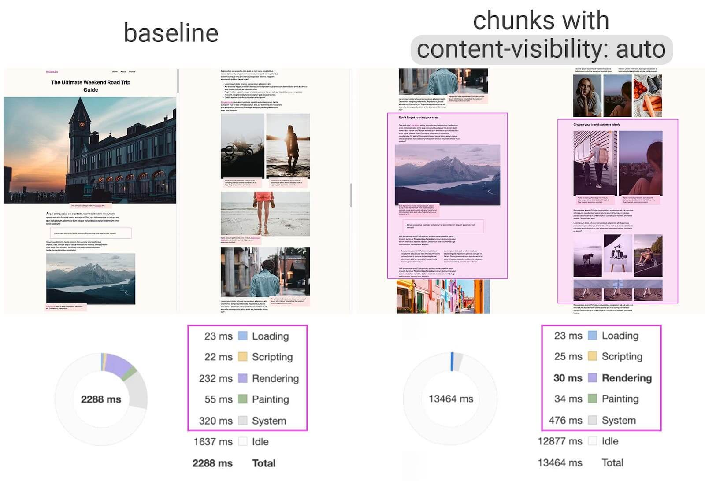
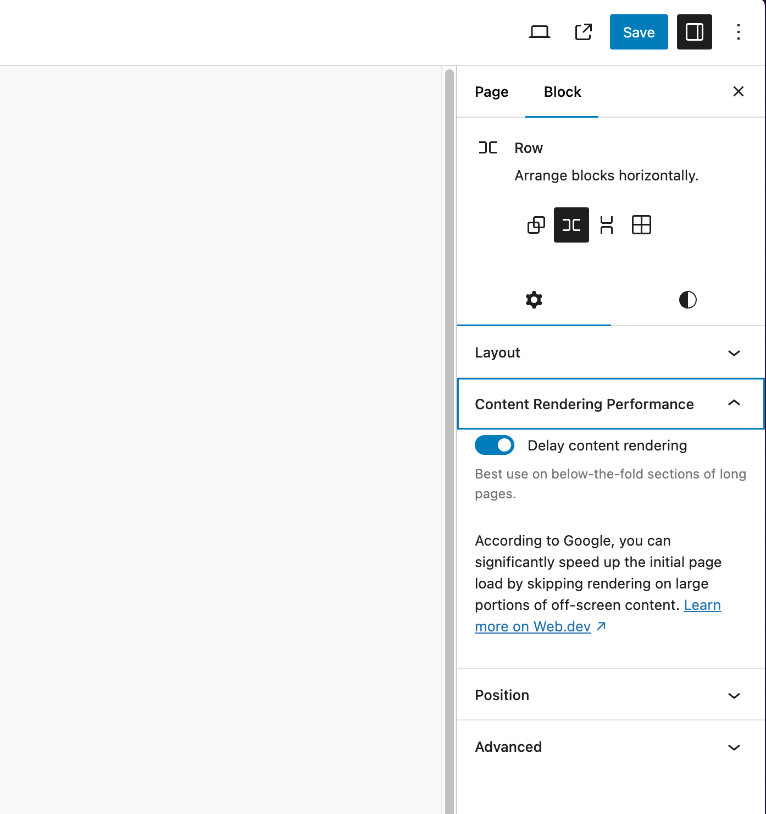

# Content Rendering Performance - WordPress Plugin

This WordPress utility plugin lets you add the `content-visibility` CSS property on group blocks. That property allows the browser to delay an element's rendering, including layout and painting until needed.

According to Google, you can significantly speed up the initial page load by skipping rendering on large portions of off-screen content.

Use this on long pages below-the-fold sections.

[Read more about content-visibility on Web.dev](https://web.dev/articles/content-visibility)

<figure>
    
    <figcaption>Source: <a href="https://web.dev/articles/content-visibility">Web.dev</a> - Google demo applying content-visibility: auto to chunked content areas gives a 7x rendering performance boost on initial load.</figcaption>
</figure>

## Plugin Screenshot

<figure>
    
    <figcaption>Content visibility panel screenshot.</figcaption>
</figure>

## Installation

The plugin is not yet available from the WordPress.org directory.

1. To find the <a href="https://github.com/ericvalois/content-visibility-auto/tags">latest release</a> for installation, use the link under Releases > Tags to download content-visibility-auto.zip.
2. Then go to your wp-admin plugins page and click on the Upload Plugin button.
3. Click on the Choose File button at the center of your screen to select the content-visibility-auto.zip file you just downloaded.
4. Select the proper zip file, click Open, then Install Now.
5. Activate the plugin.
